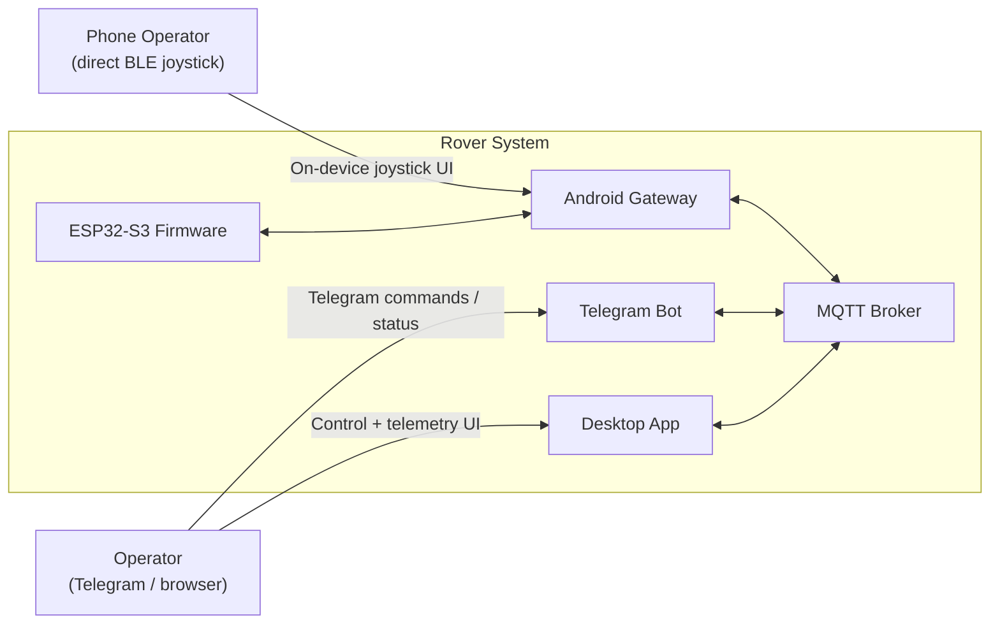
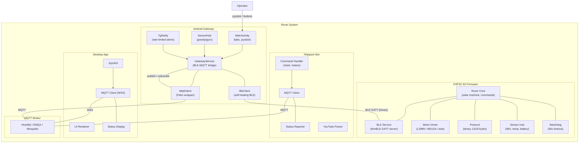
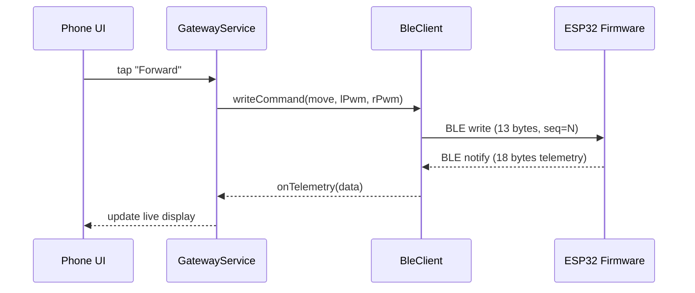
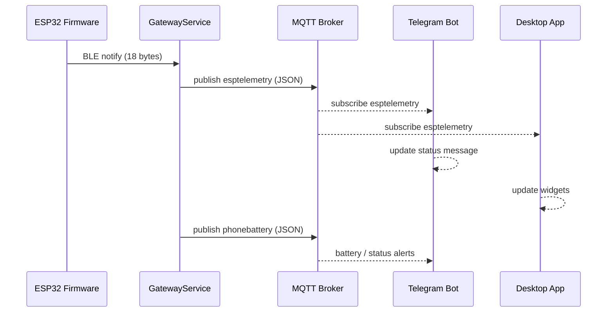
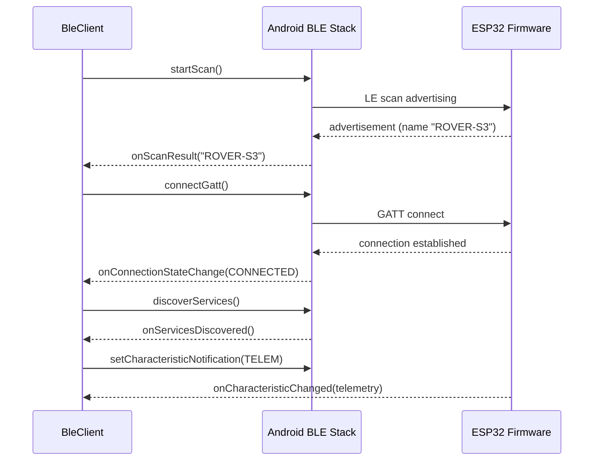

# Rover Architecture — C2 & C3 Mermaid Diagrams

## C2 — System Context

The Rover system consists of four main containers interacting over BLE and MQTT:

### Actors

| Actor | Description |
|-------|-------------|
| **Rover Hardware** | ESP32-S3-Nano with L298N motor driver, camera, IMU, temperature sensor |
| **Phone Sensors** | Android device accelerometer/gyroscope (gravity, tilt) |
| **Operator** | Remote Telegram/browser user |
| **Phone Operator** | Local user driving directly via BLE |

### Key Interactions

1. **ESP32 ↔ Android Gateway** via BLE (bidirectional commands and telemetry)
2. **Android Gateway ↔ MQTT Broker** via MQTT (publishes telemetry, subscribes to commands)
3. **Telegram Bot ↔ MQTT Broker** via MQTT (receives telemetry, sends commands)
4. **Desktop App ↔ MQTT Broker** via MQTT/WSS (receives telemetry, sends commands)

---

## C3 — Component Level

Everything inside the system boundary, per container:

### ESP32 Firmware (C3)

| Component | Responsibility |
|-----------|----------------|
| **Rover Core** | Main control loop, state machine, command processing |
| **BLE Service** | NimBLE GATT server for communication (CMD / TELEMETRY) |
| **Motor Driver** | Abstracted motor control (L298N, MD12A/MC33926, or stub) |
| **Protocol** | Binary protocol for commands and telemetry (C→S: 13 bytes, S→C: 18 bytes) |
| **Sensor Hub** | IMU (MPU6050), temperature, voltage monitoring |
| **Watchdog** | 30-second safety timeout, kills motors on disconnect |

### Android Gateway (C3)

| Component | Responsibility |
|-----------|----------------|
| **MainActivity** | Settings UI (broker, credentials), Control tab (BLE joystick), Log tab |
| **GatewayService** | Foreground service bridging BLE ↔ MQTT, owns all networking |
| **BleClient** | Self-healing BLE central with auto-scan, reconnect, backoff |
| **MqttClient** | Thin Paho MQTT v3 wrapper with auto-reconnect via `ensureConnected()` |
| **SensorHub** | Reads phone gravity sensors, sends tilt data to ESP32 |
| **TgNotify** | Rate-limited Telegram notifications (6 msgs/min global limit) |

### Telegram Bot (C3)

| Component | Responsibility |
|-----------|----------------|
| **Command Handler** | Processes /start, /status, button callbacks |
| **MQTT Client** | Subscribes to `esptelemetry`, `phonebattery`; publishes commands |
| **Status Reporter** | Periodic status updates, crash reports |
| **YouTube Parser** | Validates YouTube URLs and forwards to rover |

### Desktop App (C3)

| Component | Responsibility |
|-----------|----------------|
| **UI Renderer** | Web-based control interface (video, buttons, connection) |
| **MQTT Client** | Paho MQTT over WSS |
| **Joystick** | Touch/mouse joystick for rover movement |
| **Status Display** | Real-time telemetry (battery, motors, temperature, tilt, GPS) |

---

## Sequence Diagrams

### Command Flow (Phone → Rover)

### Telemetry Flow (Rover → Phone / Bot / Desktop)

### BLE Connection Lifecycle

---

## MQTT Topics

| Topic | Publisher | Subscriber | Payload |
|-------|-----------|------------|---------|
| `rover/{id}/cmd` | Gateway, Bot, Desktop | ESP32 | Binary command (13 bytes) |
| `rover/{id}/telemetry` | ESP32 | Gateway, Bot, Desktop | Binary telemetry (18 bytes) |
| `esptelemetry` | Gateway | Bot, Desktop | JSON telemetry |
| `phonebattery` | Gateway | Bot, Desktop | JSON battery info |
| `phonestatus` | Gateway | Bot, Desktop | JSON status |
| `phonegravity` | Gateway | ESP32 | JSON gravity vectors |
| `phonegyro` | Gateway | ESP32 | JSON gyro data |

---

## Binary Protocol

### Command (Phone/Bot/Desktop → Rover): 13 bytes

| Offset | Field | Size | Description |
|--------|-------|------|-------------|
| 0 | magic | 1 | 0xA7 |
| 1 | version | 1 | Protocol version |
| 2 | seq | 1 | Sequence number (0–255) |
| 3 | type | 1 | Command type (0–12) |
| 4 | channel | 1 | Pin/channel index |
| 5–8 | value_a | 4 | Primary value (int32) |
| 9–12 | value_b | 4 | Secondary value (int32) |

### Telemetry (Rover → Phone/Bot/Desktop): 18 bytes

| Offset | Field | Size | Description |
|--------|-------|------|-------------|
| 0 | magic | 1 | 0xA8 |
| 1 | version | 1 | Protocol version |
| 2 | seq | 1 | Sequence number |
| 3 | status | 1 | Status code |
| 4 | battery_voltage | 2 | Battery voltage (mV) |
| 6 | left_pwm | 1 | Left motor PWM (%) |
| 7 | right_pwm | 1 | Right motor PWM (%) |
| 8 | left_encoder | 4 | Left encoder pulses |
| 12 | right_encoder | 4 | Right encoder pulses |
| 16 | temperature | 1 | Temperature (°C) |
| 17 | tilt | 1 | Tilt angle (degrees) |

---

## Safety Features

1. **BLE Watchdog**: 30-second timeout kills motors if no commands received
2. **MQTT Reconnect**: Auto-reconnect with exponential backoff
3. **TG Rate Limiting**: Global 6 msgs/min limit prevents chat flooding
4. **Motor Limits**: PWM clamped to 0–100%, steering ratio limited
5. **Sequence Validation**: Commands checked for correct sequence numbers